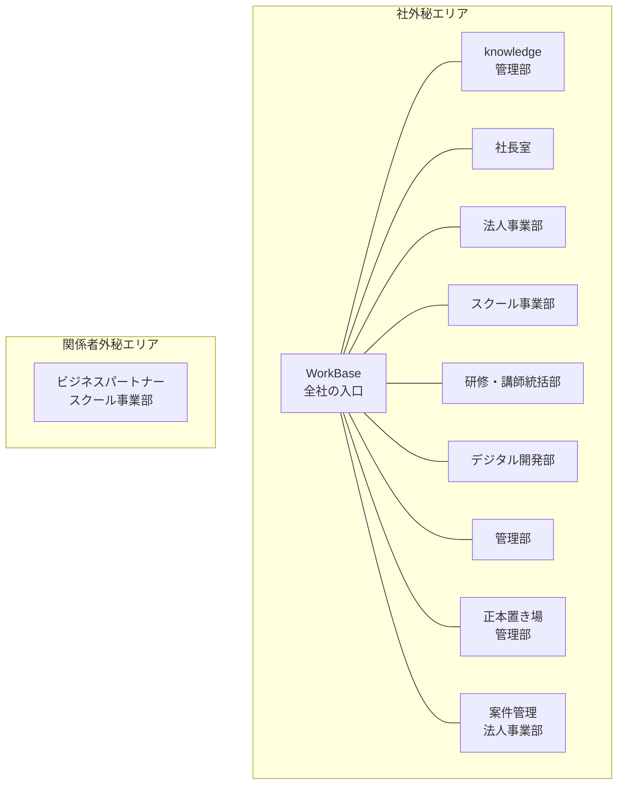

# 全社SharePointマニュアル

組織改編にともなう全社SharePointの再構築にあたり、**どのサイトに何が書かれ、何が置かれているか**を1つにまとめた資料です。

> この資料は「新しい構成での各サイトの定義」です。既存サイトの棚卸し結果ではありません。
> 各部は自部署のページを確認し、実態と違う箇所を修正してください。

---

## 3行でいうと

1. **WorkBase** を全社の入口とし、その配下に部署ごとの独立サイトを11個置きます。
2. 各サイトは **「公開ドキュメント（全社が見られる）」と「限定ドキュメント（部・課だけ）」** をライブラリで分けます。
3. 他部署への依頼は **各部サイトの問い合わせボタン → Notion Form → Notionのタスクデータベース** に統一し、進捗を全社員が見られるようにします。

## あなたが読むべき範囲

| あなたの立場 | 読む場所 | 所要時間 |
|---|---|---|
| 全社員 | 「A1 はじめに」と「A2 情報の置き場所ルール」 | 5分 |
| 依頼を出したい人・受ける人 | 上記 ＋「A6 依頼と問合せのしかた」 | 10分 |
| 各部のサイト管理者 | A1〜A6 ＋ 自部署のページ（A4配下） | 20分 |
| 情シス・デジタル開発部 | 全部（特にB1〜B3） | 40分 |
| 経営層・意思決定者 | この親ページ ＋「B5 決めること一覧」 | 10分 |

---

## サイトの全体像

**ビジネスパートナーサイトは WorkBase に接続しません。** 接続すると、業務委託者の画面に社外秘サイトの一覧が並んでしまうためです。

---

## 目次

### A. 全社員向け

| ページ | 内容 |
|---|---|
| A1 はじめに | この資料の使い方、用語、問合せ先 |
| A2 情報の置き場所ルール | SharePoint / Teams / Notion / OneDrive の使い分け |
| A3 サイト一覧の見方 | 全11サイトの一覧表と、探し方 |
| A4 各サイトの詳細 | **11サイトそれぞれに何が書かれ、何が置かれているか** |
| A5 ファイルの扱い方 | 命名規則、フォルダ、共有リンク、保存期間 |
| A6 依頼と問合せのしかた | 3つの行き先、Formの書き方、進捗の見方 |

### B. 構築・運用向け

| ページ | 内容 |
|---|---|
| B1 サイトアーキテクチャ設計 | ハブ構成を採る理由、URL方針 |
| B2 権限とグループ設計 | Entraグループ、権限マトリクス、秘密度ラベル |
| B3 依頼受付の仕組み | Notion Form と タスクDB の構成、他案との比較 |
| B4 移行計画 | 現行サイトの棚卸しから切替までの5フェーズ |
| B5 決めること一覧 | 着手前に確定が必要な論点 |

---

## この資料の更新について

- **管理者**: 管理部
- **更新頻度**: 年1回（4月）の全社棚卸しにあわせて見直し
- **各部の担当範囲**: A4配下の自部署ページは各部のサイトオーナーが更新する
- **修正依頼**: 依頼Form（宛先＝管理部・種別＝マニュアル修正）から
