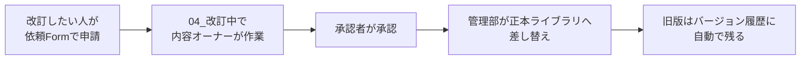

# 09 正本置き場

## 1. 何のための場所か

**「これが最新で正しい」と全社が信じてよい、唯一の場所。規程・様式・全社マニュアルの確定版を置く。**

## 2. 責任と読者

| 項目 | 内容 |
|---|---|
| 責任部署 | **管理部＝運用管理者／各文書の内容オーナー＝各部** |
| サイトオーナー | 管理部 2名 |
| 想定読者 | 全社員 |
| 閲覧範囲 | 全社員（**閲覧のみ。編集はできません**） |
| 秘密度ラベル | 社外秘 |
| URL | `/sites/wb-records` |

> **責任は2つに分かれます。** 置き場の管理・版の差し替え・見直し期限の督促は管理部が行いますが、
> 中身が正しいかどうかの責任は各文書の内容オーナー（＝所管部署）にあります。これを分けないと文書管理は機能しません。

## 3. 書かれていること

| ページ | 中身 |
|---|---|
| ホーム | 正本置き場の使い方、改訂の申請方法、**問い合わせボタン**、最近の改訂 |
| 改訂履歴 | いつ・どの文書が・第何版に改訂されたかの一覧 |
| 見直し期限一覧 | 期限が近い／過ぎている文書の一覧（管理部が督促に使う） |

## 4. 置かれているもの

| ライブラリ | 誰が見られるか | 誰が編集できるか | 中身 |
|---|---|---|---|
| `01_規程・規則` | 全社員（閲覧のみ） | 管理部のみ | 就業規則、各種規程、細則 |
| `02_様式・帳票` | 全社員（閲覧のみ） | 管理部のみ | 申請書、報告書テンプレート、契約書ひな形 |
| `03_全社マニュアル` | 全社員（閲覧のみ） | 管理部のみ | この全社マニュアルの確定版 |
| `04_改訂中` | 管理部＋内容オーナー | 管理部＋内容オーナー | 承認前の改訂版 |

### すべての文書に必須の列（メタデータ）

| 列名 | 用途 |
|---|---|
| 文書番号 | 文書を一意に識別する |
| 版数 | 第何版か |
| 制定日 / 改訂日 | いつからの版か |
| **内容オーナー** | 中身に責任を持つ人（作成者とは限らない） |
| **次回見直し期限** | この日を過ぎたら棚卸し対象 |
| 承認者 | 誰が承認したか |

### 改訂の流れ

## 5. 置かないもの

| 置かないもの | 代わりにどこへ |
|---|---|
| 下書き・検討中の資料 | `04_改訂中` または各部の限定ライブラリ |
| 各部の作業ファイル | 各部サイト |
| 規程の「解説」「読み方」 | knowledge |
| 議事録・報告書 | 各部サイト |
| 案件ごとの契約書の実物 | 案件管理（ひな形だけがここ） |

## 6. 問合せ窓口

| 用件 | 行き先 |
|---|---|
| 規程の内容を知りたい | まず該当文書を読む → 分からなければ内容オーナーの部署へ |
| 改訂したい | 依頼Form（宛先＝管理部・種別＝規程改訂） |
| 様式が見つからない | 依頼Form（宛先＝管理部） |

## 7. 更新ルール

| 対象 | 誰が | いつ |
|---|---|---|
| 各文書の内容 | 内容オーナー | 文書に設定した見直し期限まで |
| 見直し期限切れの督促 | 管理部 | 月次 |
| 正本ライブラリへの差し替え | 管理部 | 承認後すみやかに |
| 全体の棚卸し | 管理部 | 年1回（4月） |

> **旧版は削除しません。** バージョン履歴に残すことで、過去の版がいつ有効だったかを後から確認できます。
