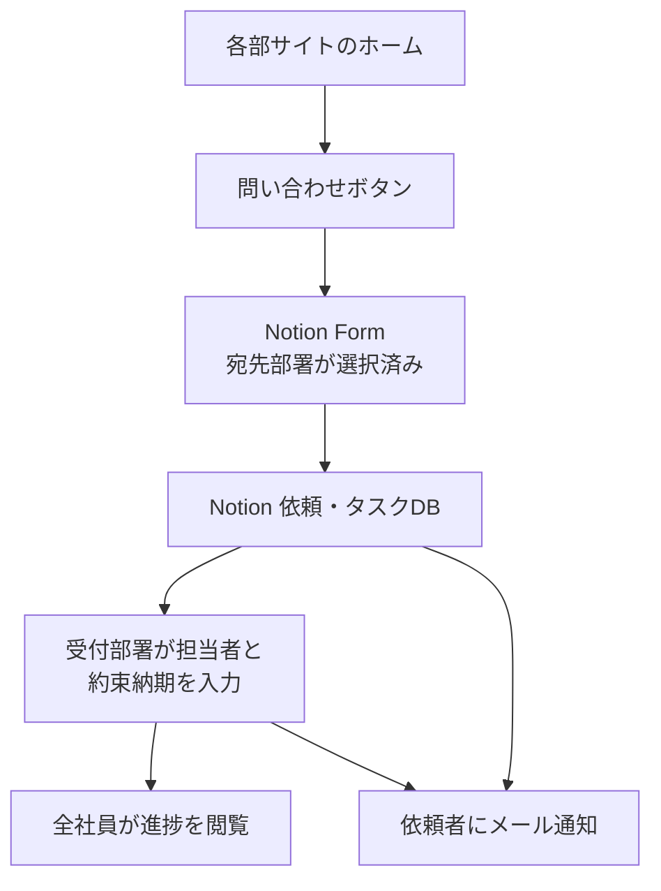

# A6 依頼と問合せのしかた

**誰向け**: 全社員（**依頼を出す人・受ける人は必読**）
**所要時間**: 5分
**この章の結論**: 調べる→knowledge、相談する→Teams、依頼する→各部サイトの問い合わせボタン。進捗はNotionで全社員が見られる。

---

## 何が変わったか

これまでは、サービス開発を担う部署はTeamsのチャネル、他の部署はFormsと、部署ごとにやり方が違いました。しかも依頼を出したあと、それがどうなったのか依頼者から見えませんでした。

これからは**全部署が同じ入口**になり、**依頼の進捗を全社員が見られる**ようになります。

## 3つの行き先

| 用件 | 行き先 |
|---|---|
| ① **調べたい**（制度・手順・様式を知りたい） | knowledge / 正本置き場 / 各部サイトのFAQ |
| ② **相談したい**（作業は発生しない。ちょっと聞きたい） | Teams の該当部署チャネル |
| ③ **お願いしたい**（作業が発生する正式依頼） | **各部サイトの問い合わせボタン** |

**基本の流れは「Teamsで相談 → 作業が発生すると分かった時点で依頼」です。**

Teamsチャネルは廃止しません。相談の敷居を上げると、結局は個人チャットに戻ってしまうからです。ただし**チャネルで受けた依頼も、受けた担当者が依頼Formに代理で起票します。** ここを徹底しないと、以前と同じ「見えない依頼」に戻ります。

## 依頼の流れ



## 各部サイトの問い合わせブロック

全部署のホームに、**同じ並びで同じ4つ**が置かれています。

```
[ ➊ この部署に依頼する ]   [ ➋ 相談する（Teams） ]
[ ➌ よくある質問（FAQ） ]   [ ➍ 依頼の進捗を見る ]
```

課ごとに窓口が分かれている部署では、➊ が課の数だけ並びます。

## 標準リードタイム

各部のホームに掲示されています。全社共通の目安は次のとおりです。

| 依頼種別 | 一次回答 | 完了目安 |
|---|---|---|
| 問合せ・確認 | 1営業日 | 3営業日 |
| 資料作成・データ抽出 | 1営業日 | 5営業日 |
| システム改修・開発 | 2営業日 | 都度見積 |

**一次回答**は「受け付けました、いつまでにやります」という返事のことです。完了ではありません。

## Formに書く内容

| 項目 | 書き方 |
|---|---|
| 宛先部署・宛先課 | 迷ったら、いちばん近そうな部署へ。違えば受付側が振り替えます |
| 依頼種別 | 選択肢から |
| 件名 | 40字以内。一覧で見て分かる言葉で |
| 依頼内容 | 何をしてほしいか |
| **背景・目的** | **何のためにそれが必要か。ここを書くと手戻りが激減します** |
| 希望納期 | いつまでに必要か |
| 緊急度 | 通常／急ぎ（理由必須）／至急（上長承認済み） |
| 関連ファイル | 参考資料があれば添付 |
| 全社公開してよいか | 人事・労務・個人情報を含む依頼は「非公開」を選んでください |

### 良い依頼・悪い依頼

| | 例 |
|---|---|
| **悪い** | 件名「資料お願いします」／内容「例の資料ください」／背景なし／納期なし |
| **良い** | 件名「A社提案用の導入事例3件の抽出」／内容「製造業・従業員300名以上の導入事例を3件」／背景「4/20のA社提案で類似事例を示したい。先方は製造業」／納期「4/18」 |

背景が書いてあると、受ける側が「その目的ならこちらの資料のほうが良い」と提案できます。

## 依頼したあと

- **受付通知**がメールで届きます。
- 進捗は **Notionの依頼・タスクDB** で見られます。自分の依頼だけを絞り込むビューもあります。
- 期限が近づくと、受付部署に督促が飛びます。
- **他の人の依頼も見られます。** 「同じことをもう誰かが頼んでいた」に気づけるようにするためです。

> **人事・労務・経理の個人案件など、全社に見せられない依頼**は、Formで「非公開」を選んでください。管理部限定のデータベースに振り分けられ、全社ビューには出ません。

## 添付ファイルの置き場所

| タイミング | 置き場所 |
|---|---|
| 依頼時の参考資料 | **Notion**（Formに添付）。依頼を進めるための材料であって、残す正本ではないため |
| 完了後の成果物 | **SharePoint**（依頼先部署のライブラリ、または案件管理） |

この切り分けにより、SharePointが依頼票の断片で埋まるのを防ぎます。

## 受付側（依頼を受ける部署）の運用

1. **1営業日以内**にステータスを「受付済」にし、担当者と約束納期を入れる
2. Teamsチャネルで受けた依頼も、**代理でFormに起票する**
3. 完了したらステータスを「完了」にする（依頼者にメールが飛びます）
4. 四半期ごとに依頼データを見返し、**頻出のものはFAQに追加**して依頼件数そのものを減らす
