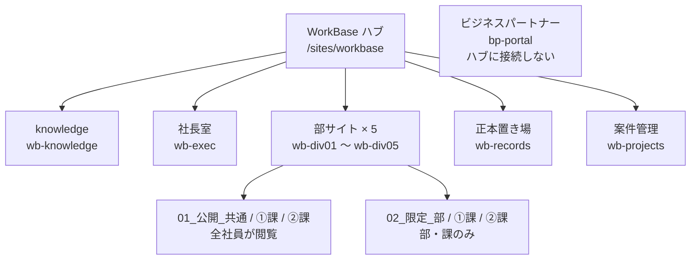

# B1 サイトアーキテクチャ設計

**誰向け**: 情シス、デジタル開発部、管理部
**所要時間**: 8分
**この章の結論**: サブサイトを使わずハブサイト＋独立サイトにする。URLに部署名を入れない。この2つが組織改編への耐性を決める。

---

## 決定1: サブサイトではなくハブサイト＋独立サイト

当初の構成案は `WorkBase ∟ 各部` という階層でしたが、これをサブサイトで実装してはいけません。

| 観点 | サブサイト | ハブサイト＋独立サイト（採用） |
|---|---|---|
| 組織改編時の移動 | ほぼ不可能。URLが親に固定され、切り離せない | ハブの関連付けを変えるだけ。数クリック |
| 権限 | 親から継承。継承を切ると管理が破綻しやすい | サイト単位で完全に独立 |
| 容量・保持ポリシー | 親と一蓮托生 | サイト単位で設定できる |
| 廃止・アーカイブ | 親ごとでないと処理できない | サイト単位でアーカイブできる |
| 検索スコープ | 親の配下として固定 | サイト単位で制御できる |

**実装**

- `WorkBase` をハブサイト（コミュニケーションサイト）として作成
- 配下の10サイトは**すべて独立したサイトコレクション**として作成し、WorkBase ハブに関連付ける
- `ビジネスパートナー` は**ハブに関連付けない**

### ビジネスパートナーをハブから外す理由

ハブに関連付けると、共通ナビゲーションに社外秘サイトの一覧が表示されます。業務委託者はリンク先を開けませんが、**サイト名の一覧そのものが組織の内部構造を明かしてしまいます。** 単独サイトとして運用してください。

## 決定2: URLに部署名を入れない

| サイト | URL |
|---|---|
| WorkBase | `/sites/workbase` |
| knowledge | `/sites/wb-knowledge` |
| 社長室 | `/sites/wb-exec` |
| 法人事業部 | `/sites/wb-div01` |
| スクール事業部 | `/sites/wb-div02` |
| 研修・講師統括部 | `/sites/wb-div03` |
| デジタル開発部 | `/sites/wb-div04` |
| 管理部 | `/sites/wb-div05` |
| 正本置き場 | `/sites/wb-records` |
| 案件管理 | `/sites/wb-projects` |
| ビジネスパートナー | `/sites/bp-portal` |

**理由**: 部署名が変わるたびにURLを変更すると、社内リンク・Teamsのファイルタブ・ブックマーク・他文書からの参照がすべて切れます。**URLは変えず、表示名（サイト名）とナビゲーションだけを変える**運用にすれば、改編に追随できます。

`div01`〜`div05` の連番は現時点の並びであり、意味は持たせません。部が増えたら `wb-div06` を足すだけです。

> **可読性とのトレードオフ**: URLを見ただけでは部署が分かりません。ただしユーザーがURLを直接読む場面はほぼなく、ナビゲーションと検索から入るため、実害は小さいと判断しています。

## 決定3: 全部署でライブラリ名を完全に統一する

| ライブラリ | 用途 |
|---|---|
| `01_公開_共通` | 部全体で全社に公開するもの |
| `01_公開_➀課` | ➀課が全社に公開するもの |
| `01_公開_②課` | ②課が全社に公開するもの |
| `02_限定_部` | 部メンバー限定 |
| `02_限定_➀課` | ➀課限定 |
| `02_限定_②課` | ②課限定 |

- 先頭の数字は並び順を固定するため
- **名前の先頭に「公開」「限定」が来る**ことで、共有操作の前に区別がつき、事故を減らせます
- 全部署が同じ構成なので、他部署のサイトに行っても迷いません

**実装**: SharePoint の**サイトテンプレート機能**で一括適用してください。手作業で5部を作ると、必ず名前や列の設定が揺れます。

## 決定4: 公開・非公開はページではなくライブラリで分ける

当初案では `【公開ドキュメント】TOP` `【非公開ドキュメント】部限定` が**ページ**として設計されていましたが、SharePointのページには権限で守る力がほとんどありません。検索結果・直リンク・共有リンクから中身に到達できてしまいます。

| | 役割 |
|---|---|
| **ページ** | 案内・説明・リンク集・体制図（読み物） |
| **ドキュメントライブラリ** | 実ファイル（守る対象） |

当初案の「【公開ドキュメント】TOP」ページは、**ホームページ内の1セクションで足ります。** ページを6枚作ると、更新されないページが5枚できます。

## 決定5: 個別権限を禁止する

**一意の権限はライブラリ単位まで。フォルダ単位・ファイル単位の個別権限は原則禁止します。**

個別権限を許すと、半年で誰も権限の全体像を説明できなくなります。組織改編のたびに棚卸しが不能になる最大の原因です。

例外的に必要な場合は、管理部の承認と台帳への記録を必須にしてください。

## 全体図

