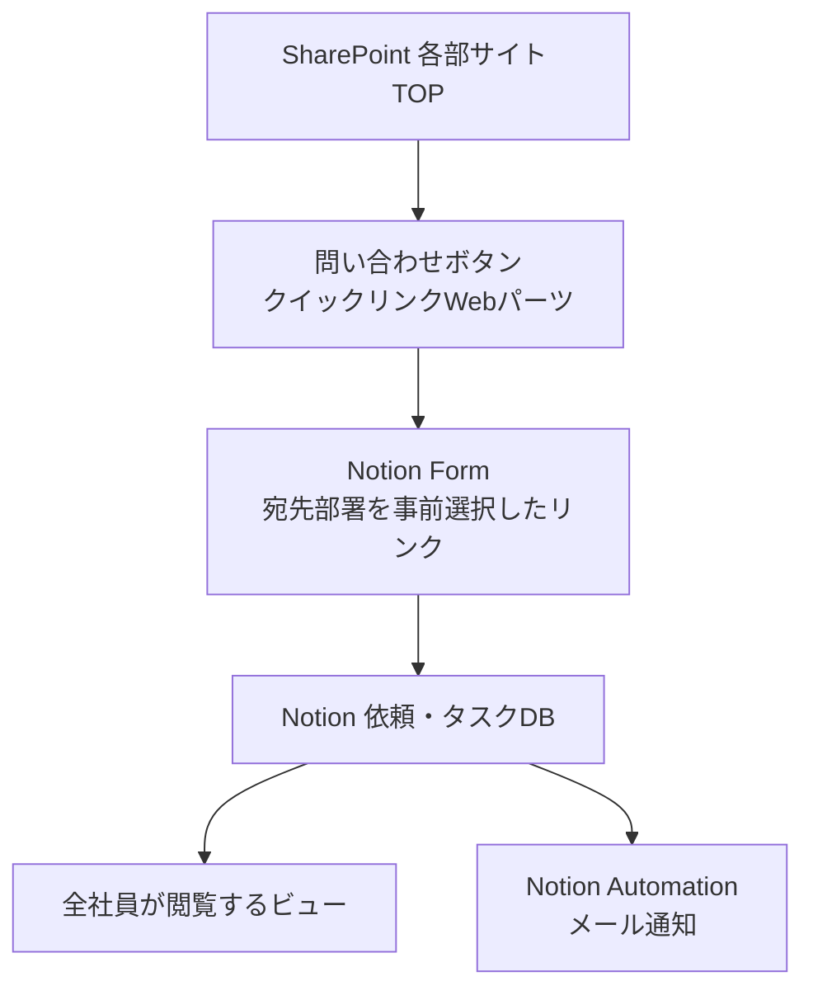

# B3 依頼受付の仕組み

**誰向け**: 情シス、デジタル開発部、管理部
**所要時間**: 10分
**この章の結論**: SharePointの問い合わせボタン → Notion Form → Notion DB。連携部品がゼロなので、壊れる箇所も追加費用もない。

---

## 採用する構成



### なぜこの構成なのか

**連携部品が1つも存在しないからです。** Power Automate も API トークンも介在しないため、壊れる箇所・保守する箇所・追加費用がすべてゼロになります。部署の増減にも、Formの選択肢を1行足すだけで追随できます。

## この構成でできること・できないこと

**省略せず、すべて記載します。**

| 項目 | 可否 |
|---|---|
| 追加ライセンスの購入 | **不要** |
| 連携基盤の保守 | **不要**（フォームとデータベースが同一製品） |
| 依頼者の自動特定 | **可能**（Notionログイン必須の設定で回答者を取得） |
| 添付ファイルの保存先 | **Notion側に保存される。SharePointには残らない** |
| 依頼者へのメール通知 | **可能**（Notion Automation） |
| Teamsへの自動通知 | **不可**（Power Automateのプレミアムコネクタが必要になるため） |
| SharePointへの進捗ボード埋め込み | **不可**（Notionがiframe埋め込みを制限）→ リンクで遷移する |
| 全社員による進捗の閲覧 | **可能**（Notionのワークスペース権限） |
| 部署別・期限超過などのビュー | **可能** |
| 組織改編への追随 | **可能**（Formの選択肢を1行追加・削除するだけ） |
| SLA督促の自動化 | **可能**（Notion Automationで期限前にリマインド） |

## 添付ファイルの切り分けルール

Notion に保存されることを踏まえ、次のように切り分けます。

| タイミング | 置き場所 | 理由 |
|---|---|---|
| 依頼時の参考資料 | Notion | 依頼を「進める」ための材料であり、「残す」正本ではない |
| 完了後の成果物 | SharePoint | 後から誰かが探しに来るもの |

これにより、SharePointが依頼票の断片で汚れるのを防げます。

どうしても最初からSharePointに置きたい場合は、Formに「SharePoint共有リンク」欄を設けてください。ただし依頼者が自分でアップロードしてリンクを取る手間が増えます。

## Notion Form の設問設計

| # | 設問 | 種類 | 備考 |
|---|---|---|---|
| 1 | 宛先部署 | 選択（必須） | 分岐の起点。各部サイトからのリンクで事前選択しておく |
| 2 | 宛先課 | 選択（必須） | 宛先部署に応じて選択肢を出し分ける |
| 3 | 依頼種別 | 選択（必須） | 問合せ／資料作成／データ抽出／システム改修／その他 |
| 4 | 件名 | 短文（必須） | 40字以内。DBのページタイトルになる |
| 5 | 依頼内容 | 長文（必須） | 記入例をプレースホルダに入れる |
| 6 | 背景・目的 | 長文（**必須**） | **必須にすると手戻りが激減する** |
| 7 | 希望納期 | 日付（必須） | |
| 8 | 緊急度 | 選択（必須） | 通常／急ぎ（理由必須）／至急（上長承認済み） |
| 9 | 関連ファイル | ファイル添付 | 契約プランで使えるか要確認 |
| 10 | 全社公開してよいか | 選択（必須） | 公開／非公開（人事・労務・個人情報を含む） |

### 設問10 が必要な理由

「全社員が進捗を見られる」という要件と、人事・労務・経理の個人案件は両立しません。**非公開を選んだ依頼は管理部限定のデータベースに振り分け**、全社ビューには出しません。

## Notion 依頼・タスクDB のプロパティ

| プロパティ | 型 | 設定元 |
|---|---|---|
| 件名 | タイトル | Form 設問4 |
| 依頼ID | ID（自動採番） | Notion の自動採番機能 |
| 依頼者 | 作成者 | Notionログインから自動取得 |
| 依頼元部署 | セレクト | Formで選択 |
| 宛先部署 | セレクト | Form 設問1 |
| 宛先課 | セレクト | Form 設問2 |
| 依頼種別 | セレクト | Form 設問3 |
| 依頼内容 | テキスト | Form 設問5 |
| 背景・目的 | テキスト | Form 設問6 |
| 緊急度 | セレクト | Form 設問8 |
| 希望納期 | 日付 | Form 設問7 |
| **約束納期** | 日付 | **受付側が入力**（希望と約束を分けることが重要） |
| ステータス | ステータス | 未受付／受付済／対応中／確認待ち／完了／差戻し／対象外 |
| 担当者 | ユーザー | 受付側が入力 |
| 受付日 | 作成日時 | 自動 |
| 完了日 | 日付 | 完了時に入力 |
| 期限超過 | 数式 | `約束納期 < today()` かつ ステータスが完了以外 |
| 公開区分 | セレクト | Form 設問10 |
| 関連リンク | URL | SharePoint / Teams へのリンク |

> **営業日での期限計算はNotionの数式では扱いづらい**ため、一次回答期限は「受付日＋2日」のような暦日ベースにするか、運用ルールとして人が判断する形にしてください。

## ビュー

| ビュー | フィルタ | 想定利用者 |
|---|---|---|
| 全社ボード | 公開区分＝公開。ステータス別カンバン、宛先部署でグループ化 | 全社員 |
| 部署別 | 宛先部署＝自部署 | 受付部署 |
| 自分の依頼 | 依頼者＝自分 | 依頼者 |
| 期限超過 | 期限超過＝true | 全社員・マネジメント |
| 今週完了 | 完了日＝今週 | 全社員 |
| 管理部限定 | 公開区分＝非公開 | 管理部のみ（別DBまたは限定ビュー） |

## SharePoint側の設置

各部サイトのホームに、**クイックリンクWebパーツ**で4つのリンクを同じ並びで置きます。

```
[ ➊ この部署に依頼する ]   [ ➋ 相談する（Teams） ]
[ ➌ よくある質問（FAQ） ]   [ ➍ 依頼の進捗を見る ]
```

➊ のリンク先は、**宛先部署を事前選択したNotion FormのURL**にします。課ごとに窓口を分ける場合は、➊ を課の数だけ並べます。

> **➍ は埋め込みではなくリンクです。** Notionはiframe埋め込みを制限しているため、SharePointページ内に進捗ボードを表示することはできません。

## 導入の順序

| Step | 内容 | 期間目安 |
|---|---|---|
| 1 | 3つの行き先（調べる／相談する／依頼する）を決めて全社周知 | 1週 |
| 2 | Notion Form を1本作る（分岐は最小限） | 1週 |
| 3 | **1部署だけでパイロット**（推奨: デジタル開発部） | 2〜4週 |
| 4 | ビューと通知を整備 | 1週 |
| 5 | 全部署展開、各サイトTOPに問い合わせブロックを設置 | 2週 |
| 6 | 1か月後に依頼データを見て、FAQとリードタイムを更新 | 継続 |

> **Step 3 のパイロットを飛ばさないでください。** 設問設計は必ず1回作り直しになります。全社展開後に設問を変えると、それ以前のデータと繋がらなくなります。

## 効果の測り方

四半期ごとに確認します。

- 依頼件数（部署別・種別別）
- 一次回答リードタイムの中央値（目標: 1営業日以内 90%）
- 完了リードタイムの中央値
- 期限超過件数
- **Form経由の割合**（個人チャット依頼が減っているか。これが本丸の指標）
- FAQで解決した割合（依頼件数そのものの減少）

---

## 補足: 他の実装方式との比較

将来 Teams通知や SharePointへの添付保存が必要になった場合の選択肢です。**現時点では採用しません。**

| | 採用案: Notion Form | 参考案A: Power Automate Premium | 参考案B: SharePointリスト |
|---|---|---|---|
| 追加ライセンス購入 | 不要 | 必要（**1シート**、月額約$15） | 不要 |
| 添付の保存先 | Notion | SharePoint | SharePoint |
| Notionへの自動起票 | できる（ネイティブ） | できる | できない（手動入力） |
| Teamsへの自動通知 | できない | できる | できる |
| SharePointへの埋め込み | できない | できない | **できる** |
| 保守対象 | なし | Power Automateのフロー3本 | Power Automateのフロー1本 |
| 二重入力 | 発生しない | 発生しない | **発生する** |

### なぜ Power Automate では追加ライセンスが要るのか

M365 Business プランに含まれるのは *Power Automate for Microsoft 365* という枠で、**標準コネクタのみ**が対象です。

- **Notion コネクタ** … プレミアム扱い
- **HTTP アクション**（Notion API を直接呼ぶ場合に使う） … プレミアム扱い
- `SharePoint に HTTP 要求を送信` … 標準だが**宛先がSharePointに限定**され、Notionは呼べない

つまり、コネクタ経由でもAPI直叩きでも、標準ライセンスのままではNotionへ書き込めません。

必要になった場合でも、**Premiumが要るのはフローの所有者1アカウントだけ**です。管理部に運用専用アカウントを作ってそこに1シート付ければ、全社分のフローが動きます。依頼を出す社員側には不要です。Premiumには90日の無料試用があるため、購入前に検証できます。
