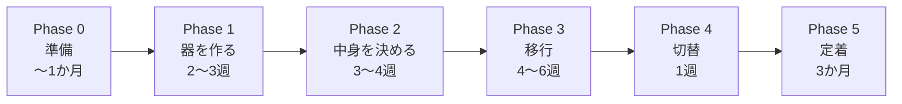
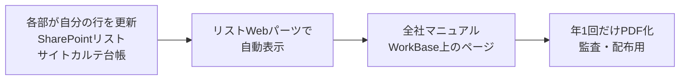

# B4 移行計画

**誰向け**: 管理部、デジタル開発部、各部のサイト管理者
**所要時間**: 8分
**この章の結論**: 全部を移行しない。リセットの最大の価値は捨てること。移行対象は全体の3割以下を目安に。

---

## 全体スケジュール

## Phase 0: 準備（〜1か月）

- [ ] 本資料の内容について合意する（特に「B5 決めること一覧」）
- [ ] **新組織の部・課を確定する**（これが決まらないと権限グループが作れません）
- [ ] 現行サイトの棚卸し
- [ ] Entraグループ・秘密度ラベルの設計と作成

### 現行サイト棚卸しシート

| サイト名 | URL | 容量 | 最終更新 | 管理者 | 判定 | 移行先 |
|---|---|---|---|---|---|---|
| | | | | | 移行／正本化／アーカイブ／廃棄 | |

### 判定の基準

| 判定 | 条件 |
|---|---|
| **移行** | 直近1年でアクセスがあり、今後も使う |
| **正本化** | 規程・様式 → 正本置き場へ。内容の確認と版の確定が必要 |
| **アーカイブ** | 使わないが法定保存・監査で必要 → 読み取り専用で保管 |
| **廃棄** | 保持期間を過ぎている |

> **全部を移行しようとしないでください。** リセットの最大の価値は「捨てること」です。目安として、移行するのは全体の3割以下です。

## Phase 1: 器を作る（2〜3週）

- [ ] WorkBase ハブを作成
- [ ] 10サイトを作成し、ハブに関連付ける
- [ ] **サイトテンプレート機能**で標準ライブラリ・メタデータ列・ページを一括適用する
- [ ] 権限グループを割り当て、秘密度ラベルを適用する
- [ ] ビジネスパートナーサイトを別途作成（ハブに関連付けず、外部共有を個別設定）

> テンプレートを使わず手作業で5部を作ると、必ずライブラリ名や列の設定が揺れます。揺れると全社マニュアルが成立しなくなります。

## Phase 2: 中身を決める（3〜4週）

- [ ] 各部が「A4 各サイトの詳細」の自部署ページを確認・修正する
- [ ] 管理部がレビューする（**「置かないもの」が書かれているかを重点確認**）
- [ ] 各部サイトのホームページを作成する（問い合わせブロックを含む）
- [ ] サイトカルテ台帳（SharePointリスト）に11行を登録する

## Phase 3: 移行（4〜6週）

- [ ] 判定「移行」のファイルを新サイトへ移す（SharePoint Migration Manager）
- [ ] **移行時に命名規則とメタデータを付与する**（移行後にやると、まずやりません）
- [ ] 正本の確定作業（各部の内容オーナーが「これが最新」を宣言する）
- [ ] 判定「アーカイブ」を読み取り専用で保管する
- [ ] 判定「廃棄」を削除する

## Phase 4: 切替（1週）

- [ ] 全社説明会（「A2 情報の置き場所ルール」と「A6 依頼と問合せのしかた」の内容）
- [ ] 旧サイトを**読み取り専用**に変更し、トップに移行先の案内バナーを設置する
- [ ] 新サイトを全社公開する
- [ ] Teamsのファイルタブ・ブックマークの張り替えを案内する

## Phase 5: 定着（切替後3か月）

- [ ] 週次で**旧サイトへのアクセス数**を確認する（減らなければ移行漏れがあります）
- [ ] 1か月後: 依頼データを見てFAQを更新する
- [ ] 3か月後: 旧サイトをアーカイブする（Microsoft 365 Archive）
- [ ] 以後: 年1回（4月）の棚卸しを定例化する

---

## 「一つの資料にまとめる」を維持する仕組み

この資料をWordやPowerPointで1本作ると、**3か月で実態と乖離します。** サイトは変わり続けるためです。

そこで2階建てにします。

- 各部は**自分の行を更新するだけ**。資料の取りまとめ作業が発生しません。
- 全社マニュアルのページは、固定の解説文＋リストWebパーツ（台帳の埋め込み）で構成します。
- 紙が必要なときだけ、年1回PDF化します。

### サイトカルテ台帳リストの列

WorkBase サイトに作成します。

| 列名 | 型 |
|---|---|
| サイト名 | 単一行テキスト（タイトル） |
| URL | ハイパーリンク |
| エリア | 選択（社外秘／関係者外秘） |
| 責任部署 | 選択 |
| サイトオーナー | ユーザー（複数） |
| 目的 | 複数行テキスト |
| 想定読者 | 選択（複数） |
| 秘密度ラベル | 選択 |
| 置くもの | 複数行テキスト |
| 置かないもの | 複数行テキスト |
| ライブラリ構成 | 複数行テキスト |
| 問合せ窓口 | ハイパーリンク |
| 最終棚卸し日 | 日付 |
| 次回見直し期限 | 日付 |

権限は「全社員 閲覧／各部オーナー 編集」とし、変更履歴で牽制します。

---

## 組織改編に強くしておくための仕込み

今回の再構築が「一度きり」で終わらないよう、次の改編で困らない形にしておきます。

| 仕込み | 効果 |
|---|---|
| サイトURLに部署名を入れない | 改編でURL変更＝大量リンク切れが起きない |
| 権限は動的グループ（`user.department`）経由 | 人事データの更新だけで権限が追随。手作業ゼロ |
| ライブラリ名を全部署共通に固定 | 部が増減しても構成が揺れない |
| ハブ関連付けで階層を表現 | 部の統廃合は関連付けの付け替えだけ |
| 依頼Formは1本＋選択肢 | 部の増減は選択肢の追加・削除のみ |
| サイトカルテを台帳（リスト）で管理 | マニュアルの作り直しが不要。行の更新だけ |
